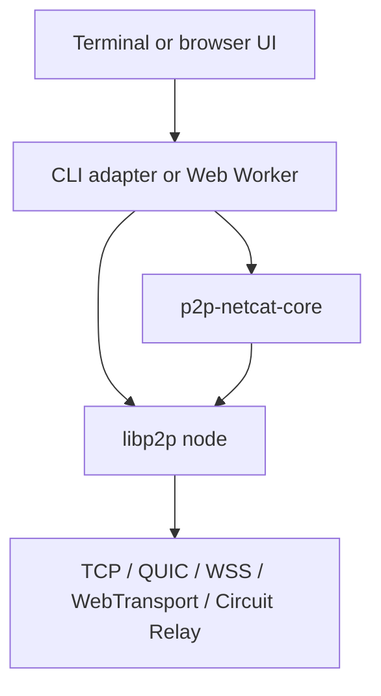

# p2p-netcat architecture and connection algorithm

**English** | [Русский](ARCHITECTURE.RU.md)

This document describes the current implementation of the shared JavaScript
library, CLI, browser PWA, PeerId discovery, route selection, secure channel
setup, and byte-stream handling.

## System model

`p2p-netcat` replaces the usual `IP address + port` pair with:

```text
PeerId + logical port
```

The logical port is mapped to a libp2p protocol ID. For example, `31337`
becomes `/p2p-netcat/1.0.0/31337`. PeerId identifies the cryptographic peer;
a multiaddr describes a currently usable route to that peer. PeerId does not
embed a current IP address, so discovery must still produce at least one
reachable multiaddr.

## Components



The browser-safe core package owns validation, protocol-ID construction,
multiaddr normalization, relay route planning, browser address checks,
transport ranking, the PubSub topic, and the WebRTC STUN pool. Node creation,
DHT access, stdin/stdout, IndexedDB, and Worker RPC remain in their platform
adapters.

The CLI supplies persistent identities, TCP/QUIC, mDNS, Amino DHT, stream
bridging, command execution, and relay-server mode. React owns the browser UI;
all libp2p networking runs in a module Web Worker. The Service Worker only
caches and updates the PWA shell—it does not carry P2P traffic.

## Identity and protocol selection

The listener stores an Ed25519 private key in
`~/.config/p2p-netcat/identity.key`, using `0700` for the directory and `0600`
for the key. The public-key identity produces a stable PeerId. CLI clients use
an ephemeral identity unless `--identity` is supplied; the browser identity is
also currently ephemeral.

The shared library validates logical ports in the `1..65535` range and maps
them to `/p2p-netcat/1.0.0/{port}`. These are service selectors, not operating
system TCP or UDP ports.

## CLI listener algorithm

1. Validate the logical port and load or create the persistent key.
2. Create a libp2p node with QUIC v1, TCP, WebSocket, Circuit Relay v2, Noise,
   Yamux, identify, ping, mDNS, signed GossipSub peer discovery, bootstrap
   discovery, and Amino DHT.
3. Register a handler for the selected p2p-netcat protocol ID.
4. Print PeerId and current multiaddrs to stderr.
5. Publish a provider record for the listener's PeerId CID. Publication has a
   60-second timeout, retries after 5 seconds, and refreshes every 6 hours.
6. Bridge an authenticated inbound stream to stdin/stdout or to the command
   selected by `-e`.
7. Stop after one session, or keep accepting sessions with `-k`.

Provider results are accepted only when the provider ID equals the requested
PeerId. The secure libp2p handshake performs the final identity verification.

## CLI client algorithm

1. A full multiaddr bypasses discovery.
2. With `--relay`, the first configured relay becomes
   `relay/p2p-circuit/p2p/targetPeerId`.
3. Otherwise, the client checks its peer store, which can contain information
   learned through mDNS, signed GossipSub announcements, bootstrap, identify,
   or an earlier query.
4. It searches for a provider record of the target PeerId CID, with up to four
   seconds per attempt.
5. It then runs Amino DHT `findPeer`, also with up to four seconds per attempt.
6. The process repeats every 500 ms until `-w`, which defaults to 60 seconds.
7. `dialProtocol()` opens the stream for the selected logical-port protocol.

The shared rank order is WebRTC Direct, QUIC v1, WebTransport, WSS, WS, TCP,
other addresses, then Circuit Relay. Each runtime can use only transports it
actually implements.

## Browser route algorithm

The UI exchanges `start`, `connect`, `send`, `closeWrite`, and `stop` RPC
messages with the Worker. ArrayBuffers are transferred rather than cloned.
The Worker uses WebTransport, WebSocket, Circuit Relay v2, Noise, Yamux,
signed GossipSub peer discovery, bootstrap discovery, and Amino DHT client
mode.

When the manual relay field is empty:

1. Read the last successful route from IndexedDB. Entries expire after 24
   hours; a cached route gets a six-second dial attempt.
2. Continuously accept valid p2p-netcat GossipSub announcements into the peer
   store while the other discovery branches run.
3. Load static `network-config.json`, falling back to an embedded configuration.
4. Query every delegated routing endpoint for both `peers/{PeerId}` and
   `providers/{PeerId-CID}`. Those HTTP requests run concurrently with an
   eight-second timeout each.
5. If delegated routing returns no browser-usable address, check the peer store,
   query the provider record, and then run `findPeer` through Amino DHT for up
   to 20 seconds.
6. Keep WebTransport and WS/WSS addresses only. An HTTPS page rejects insecure
   WS; ordinary TCP and Node.js QUIC addresses are not browser-dialable.
7. Add optional WSS relay routes from `network-config.json`.
8. Start `dialProtocol()` for all candidate routes concurrently. `Promise.any`
   selects the first successful stream and AbortControllers cancel the losers.
9. Cache the winning multiaddr in IndexedDB for the next session.

Delegated Routing and DHT are sequential fallback layers. The dial attempts for
the resulting candidate multiaddrs are the parallel part.

Native WebRTC runs in parallel with the complete libp2p branch. Server and
client derive a deterministic room from `PeerId + logical port`, hash it into a
signaling topic, and race project-owned Nostr and WebTorrent tracker adapters.
Public relays and trackers carry only SDP signaling. A Trystero compatibility
attempt starts after four seconds if native WebRTC has not already won.

Each connection attempt sends a random 32-byte challenge. The CLI server signs
a domain-separated transcript with its persistent Ed25519 key; the client
checks the signature and derives the exact requested PeerId from the supplied
public key. The native listener exposes the application stream only after the
client returns `AUTH_READY`. The first authenticated libp2p or WebRTC channel
cancels the losing attempts. All branches use the connection timeout entered
in the UI; the Worker enforces it around its complete cache, Delegated Routing,
DHT, and dial sequence.

All WebRTC paths receive the same ICE configuration from the core package. It
contains nine `stun:` URLs: five Google endpoints plus CounterPath, Sipgate,
VoIPBuster, and InternetCalls. STUN exposes public NAT mappings to the WebRTC
stack; no p2p-netcat payload is sent through a STUN server.

The native tracker adapter uses complete non-trickle SDP, maintains a bounded
offer pool, and connects to several WebTorrent trackers. The independent Nostr
adapter publishes short-lived signed events through several relays. Both
deduplicate signaling and reconnect WebSockets with bounded exponential
backoff. Once authenticated, a 15-second `ping`/`pong` control exchange keeps
an otherwise idle data channel active. Trystero retains its trickle-ICE tracker
strategy only for compatibility with published peers.

When a native data channel closes unexpectedly, `WebRtcStream` enters
`reconnecting` for 120 seconds, keeps the async iterator open, and blocks
bounded writes behind a peer-availability waiter. The endpoint controller
creates new offers with the same 20-character client-session identity and
rebinds the replacement data channel to the existing logical stream. The
`resume` control frame clears stale flow credits. Explicit EOF, abort, shutdown,
or expiry of the grace period still finalizes the stream. This keeps the same
`node-pty` process alive across transient ICE failures and ordinary browser
background throttling.

If a manual relay is supplied, automatic discovery is skipped. The core package
requires a relay PeerId, WS/WSS transport, and WSS for an HTTPS page, then builds
the final Circuit Relay route.

## PubSub discovery model

CLI nodes, relays, and the browser Worker subscribe to
`io.github.santaklouse.p2p-netcat.peer-discovery.v1`. Every ten seconds,
`@libp2p/pubsub-peer-discovery` publishes the node public key and current
multiaddrs. GossipSub uses `StrictSign` by default. The discovery decoder derives
the advertised PeerId from the embedded public key, while the GossipSub envelope
authenticates its publisher. Discovery is still not a trust anchor: a malicious
publisher can advertise an unusable route, but the final Noise/QUIC handshake
must prove ownership of the requested PeerId before a stream is accepted.

PubSub is deliberately additive. It does not bootstrap a disconnected node and
does not make PeerId lookup globally guaranteed: an announcement propagates
only through connected subscribers that carry the same application topic.
Generic public IPFS bootstrap nodes are not required to carry that topic. The
CLI option `--no-pubsub` disables this branch. A p2p-netcat relay participates
by default and can therefore forward announcements between already connected
clients.

## Secure channel and data flow

Discovery is a routing aid, not a trust anchor. During the libp2p handshake the
remote peer proves ownership of the target PeerId key. A mismatched identity is
rejected. Direct QUIC uses QUIC TLS 1.3; the configured libp2p connection
encrypter is Noise. Yamux carries the selected logical-port stream.

Application data is an unframed byte stream—there is no JSON envelope or line
protocol. CLI sending and receiving run concurrently and honor backpressure.
EOF closes the write side after the optional `--quit-delay` while receiving can
continue. The browser reads files as streams and transfers each chunk to the
Worker.

Interactive terminal output has a bounded, end-to-end pipeline:

1. `node-pty` emits terminal bytes and the server encodes them as PTY data
   frames.
2. The server sender counts queued bytes. At 512 KiB it calls `IPty.pause()`;
   once the queue falls to 128 KiB it calls `IPty.resume()`.
3. A libp2p stream waits for `onDrain()`. A WebRTC stream first negotiates
   `flow:1`, then limits unacknowledged payload to 256 KiB.
4. The receiver sends `ack:<bytes>` only when its async iterator advances after
   the consumer has processed the previous chunk. Peers without `flow:1`
   continue using the legacy behavior.
5. For libp2p browser routes, the Worker permits at most 512 KiB of output to
   wait on the main thread and resumes below 128 KiB.
6. The main thread acknowledges a Worker block only after xterm calls the
   completion callback supplied to `Terminal.write()`.
7. During a recoverable WebRTC disconnect the same bounded queues wait for up
   to 120 seconds; they are neither converted to EOF nor allowed to grow
   without limit.

The result is bounded memory at every producer/consumer boundary. Interactive
output is deliberately excluded from the browser's downloadable-response
buffer; xterm's finite scrollback is the retained terminal history. If the
remote side closes normally, queued PTY writes are discarded during teardown
without reporting the misleading secondary error `Cannot write to a stream
that is closed`. A write failure while the stream is still open remains a real
session error.

gs-netcat-style adapter modes sit above the same authenticated stream. Client
`-p` creates a local TCP listener and opens one P2P stream per socket. Listener
`-d/-p` bridges each stream to a TCP destination; `-S` parses SOCKS4/4a/5 before
dialing the requested destination. Interactive `-i` frames PTY data and resize
events, while `node-pty` owns the server pseudoterminal. The browser enables
this framing explicitly, decodes it before UI delivery, renders ANSI with
xterm, and sends keyboard and resize events through either libp2p or WebRTC.
Tor `-T` disables all
direct and UDP discovery paths and re-executes a relay-only client under
`torsocks`.

A relay carries the already protected libp2p channel. It can observe PeerIds,
addresses, timing, and volume, but not application bytes. DHT and delegated
routing can observe lookup metadata; the design does not provide anonymity.

## Static browser configuration and PWA

`web/public/network-config.json` contains delegated HTTP Routing V1 endpoints
and an optional WSS relay pool. An empty relay list means no hidden relay is
required by default. The file is a static GitHub Pages asset and is included in
the PWA precache.

The generated Service Worker caches HTML, CSS, JavaScript, the module Worker,
manifest, images, and JSON. Offline startup means the UI shell can open from
cache; route discovery and P2P communication still require network access
unless the peer is locally reachable.

## Operational limits

- PeerId alone cannot guarantee reachability when the peer is offline, has not
  published an address, or is behind NAT without a working relay reservation.
- Browsers cannot dial ordinary TCP or Node.js QUIC multiaddrs.
- WebRTC cannot guarantee traversal of symmetric NAT; without reachable TURN,
  Circuit Relay remains the fallback.
- STUN services may observe source addresses and timing; they provide no SLA and
  do not relay traffic.
- PubSub discovery needs an already reachable compatible mesh member and is not
  a global rendezvous service.
- Public WebTorrent trackers may be unavailable and provide no SLA.
- Automatic tracker reconnection improves availability but cannot make a
  third-party signaling network 100% reliable.
- Public IPFS peers do not guarantee arbitrary Circuit Relay capacity.
- There is no PeerId allowlist or application authorization layer yet.
- Netcat-style UDP datagrams are not implemented; QUIC still carries a reliable
  ordered stream.
- An IPFS HTTP gateway is neither a transport nor a Circuit Relay.

## Source map

| File | Responsibility |
|---|---|
| `packages/core/src/index.js` | Validation, protocol IDs, PTY codec, relay plans, discovery constants, STUN pool |
| `src/identity.js` | CLI Ed25519 identity storage |
| `src/node.js` | Node.js libp2p and signed PubSub discovery construction |
| `src/relay.js` | Public `p2p-netcat/relay` lifecycle API |
| `src/discovery.js` | CLI DHT publication and PeerId resolution |
| `src/forwarding.js` | TCP forwarding, SOCKS4/4a/5, and local listeners |
| `src/pty.js` | Interactive PTY framing, raw client, and login shell |
| `src/session.js` | Bidirectional streams, backpressure, and `-e` |
| `src/tor.js` | Tor option detection and isolated torsocks re-exec |
| `src/cli.js` | CLI commands and lifecycle |
| `web/app/p2p-client.ts` | React-to-Worker RPC |
| `web/app/browser-terminal.tsx` | ANSI terminal rendering, keyboard input, resize, and `Ctrl-E q` |
| `web/app/p2p.worker.ts` | Browser libp2p, discovery, route race, and cache |
| `web/public/network-config.json` | Static routing endpoints and relay pool |
| `web/vite.config.ts` | Static build and PWA configuration |
