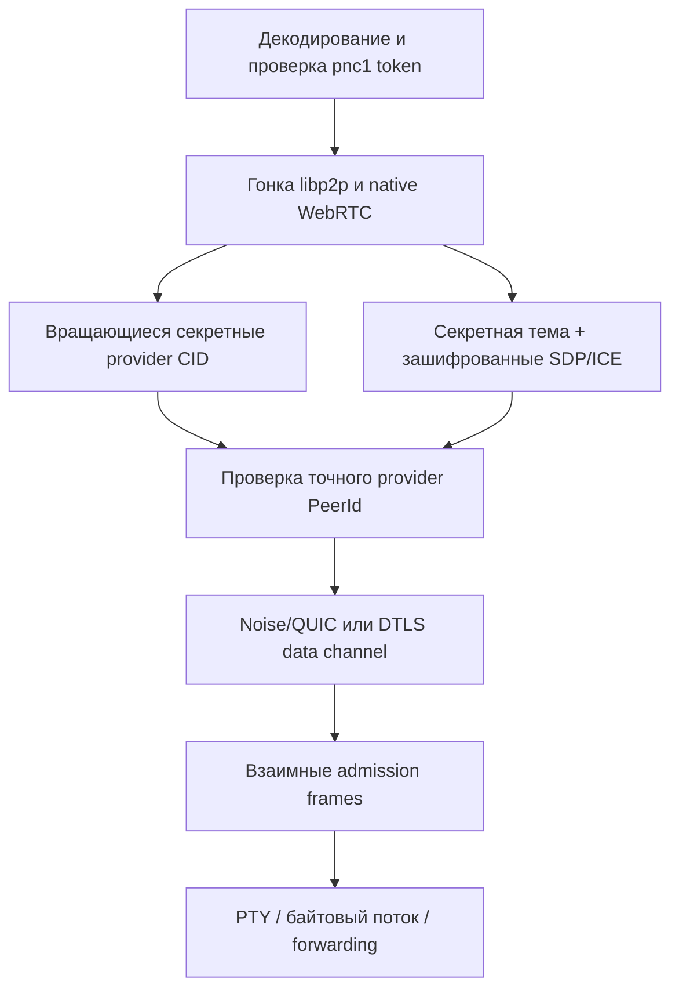

# Приватный pairing и wire-протокол

[English](PAIRING_PROTOCOL.md) | **Русский**

Это межъязыковая спецификация приватного режима `p2p-netcat`. JavaScript —
первая реализация, но форматы и криптографические операции намеренно не зависят
от JavaScript, чтобы будущая версия на Go могла взаимодействовать с ней
побайтово.

## Цели и ограничения

В обычном режиме p2p-netcat ищет публичный PeerId, поэтому routing-провайдеры
могут видеть, какой узел запрашивается. Приватный pairing заменяет публичные
ключи поиска на rendezvous-идентификаторы, вычисленные из общего секрета, и
добавляет взаимный admission handshake поверх выбранного транспорта.

Режим предоставляет:

- один переносимый token с PeerId сервера, логическим портом, 256-битным
  секретом, необязательными relay hints и сроком действия;
- вращающиеся IPFS provider CID, которые нельзя вычислить только из PeerId;
- зашифрованный native WebRTC signaling через Nostr relay и WebTorrent tracker;
- взаимное доказательство знания token до передачи прикладных байтов;
- подписанный версионированный RouteRecord для дальнейшего развития
  децентрализованного обмена маршрутами;
- одинаковую семантику в Node.js и статическом браузерном PWA.

Это не анонимность. Relay или прямой peer всё ещё видит сетевые адреса, время
соединения и объём трафика. Получивший token видит содержащиеся в нём PeerId и
relay hints, может найти сервер и пройти admission до истечения или замены
token.

## Работа с CLI

Создать token из постоянной identity слушателя:

```bash
p2p-nc token 31337 --identity ~/.config/p2p-netcat/identity.key
```

Добавить срок действия и relay:

```bash
p2p-nc token 31337 \
  --identity ~/.config/p2p-netcat/identity.key \
  --expires-in 86400 \
  --relay /dns4/relay.example/tcp/443/wss/p2p/12D3KooWEqeQRAJ61HSv9yMPk8yzjke7NxmTFcvFt4GzwXxzVjXW
```

Запустить слушатель, не раскрывая секрет в списке процессов:

```bash
export P2P_NETCAT_TOKEN='pnc1_...'
p2p-nc -l -i
```

Подключить другой CLI:

```bash
export P2P_NETCAT_TOKEN='pnc1_...'
p2p-nc -i
```

PeerId и логический порт можно не указывать: они являются проверяемыми полями
token. Для файла с ограниченными правами есть `--pairing-token-file`. В
браузере тот же token вводится в разделе «Приватный доступ и relay»,
автоматически заполняет PeerId и порт и не сохраняется в `localStorage`.

## Алгоритм соединения



Слушатель публикует provider records для предыдущего, текущего и следующего
пятиминутного окна. Клиент запрашивает три CID параллельно. Поэтому небольшой
дрейф часов и граница окна не делают пиры невидимыми. В приватном режиме CLI и
браузер не переходят к `findPeer(PeerId)`. CLI отключает объявление PeerId в
общей теме PubSub peer-discovery, а браузерный Worker вообще не входит в эту
публичную discovery-тему.

Native WebRTC по-прежнему параллельно использует Nostr и WebTorrent signaling.
Тема является стабильным идентификатором из секрета на время жизни token, а
каждый SDP или ICE payload отдельно защищён AES-256-GCM. Стабильная тема не
разрывает длительную signaling-сессию на границе временного окна. Публичный
compatibility-путь Trystero при наличии token отключён.

Первый транспорт, подтвердивший точный PeerId сервера, выполняет pairing
admission handshake. Прикладные байты выдаются только после того, как обе
стороны доказали знание одного секрета.

## Формат pairing token

Текстовая форма:

```text
pnc1_ || base64url(canonical-CBOR-map)
```

Base64url — URL-safe кодирование RFC 4648 без padding. CBOR использует
детерминированные правила RFC 8949. Неопределённые длины, неизвестные ключи,
NaN и бесконечности отклоняются.

| Числовой ключ | Тип | Значение |
|---:|---|---|
| `0` | unsigned integer | версия, строго `1` |
| `1` | UTF-8 text | канонический libp2p PeerId |
| `2` | unsigned integer | логический порт `1..65535` |
| `3` | byte string | ровно 32 случайных байта |
| `4` | array of text | отсортированные уникальные relay multiaddr, максимум 16 |
| `5` | unsigned integer | необязательный Unix timestamp истечения в секундах |

Token является bearer credential. Его нельзя записывать в логи, URL, хранилище
браузера, shell history или git. Предпочтителен environment variable или файл,
доступный только владельцу.

## Вывод ключей

Все ключи выводятся HKDF-SHA-256:

```text
IKM  = token.secret
salt = UTF8("p2p-netcat/pairing/v1")
info = UTF8("p2p-netcat/" || purpose || "/v1")
L    = 32 bytes
```

Разрешённые purpose: `rendezvous`, `signaling`, `admission` и `route-record`.
Разделение доменов обязательно: ключ одного назначения нельзя применять для
другого.

## Вращающийся rendezvous и provider CID

Интервал по умолчанию — 300 секунд:

```text
epoch = floor(unixMilliseconds / 1000 / 300)
```

Для purpose `dht`, `pubsub` или `signaling`:

```text
message =
  UTF8("p2p-netcat/rendezvous/v1") || 0x00 ||
  UTF8(purpose)                    || 0x00 ||
  UTF8(peerId)                     || 0x00 ||
  UTF8(decimal(service))           || 0x00 ||
  UTF8(decimal(epoch))

rendezvousId = base64url(HMAC-SHA-256(rendezvousKey, message))
```

IPFS provider key — CIDv1 с raw codec и SHA-256 multihash:

```text
digest = SHA-256(UTF8("p2p-netcat:rendezvous:v1:" || rendezvousId))
cid    = CIDv1(raw, digest)
```

Provider result — подсказка маршрута, а не identity. Адрес принимается только
если provider PeerId равен PeerId из token, после чего transport handshake
снова обязан аутентифицировать этот PeerId.

## AEAD envelope

Приватный signaling использует AES-256-GCM со свежим случайным 12-байтовым
nonce и 128-битным authentication tag. Бинарный envelope — детерминированный
CBOR:

| Числовой ключ | Тип | Значение |
|---:|---|---|
| `0` | unsigned integer | версия envelope, строго `1` |
| `1` | byte string | 12-байтовый nonce |
| `2` | byte string | ciphertext и следующий за ним 16-байтовый GCM tag |

Метаданные signaling — версия, секретная комната, тип сообщения, session ID,
отправитель, необязательный получатель и время — аутентифицируются как
additional data. SDP и ICE candidates находятся внутри ciphertext. Tracker
видит wrapper `pnc-signal-v1:`, а не SDP.

## Взаимные admission frames

Оба frame имеют ровно 62 байта и используют network byte order:

| Смещение | Размер | Значение |
|---:|---:|---|
| `0` | 4 | ASCII `PNCA` |
| `4` | 1 | версия `1` |
| `5` | 1 | тип: client hello `1`, server acknowledgement `2` |
| `6` | 8 | unsigned Unix time в секундах, big-endian |
| `14` | 16 | случайный nonce |
| `30` | 32 | HMAC-SHA-256 |

MAC клиента:

```text
UTF8("p2p-netcat/session-auth/v1") || 0x00 ||
UTF8("client")                     || 0x00 ||
UTF8(peerId)                       || 0x00 ||
UTF8(decimal(service))             || 0x00 ||
UTF8(decimal(timestamp))           || 0x00 ||
clientNonce
```

Server acknowledgement использует роль `server` и добавляет
`clientNonce || serverNonce`. Сервер принимает timestamp клиента в пределах
120 секунд от своих часов. MAC сравнивается за постоянное время. Некорректный
frame немедленно закрывает поток, а authentication bytes никогда не передаются
приложению.

## Подписанный RouteRecord

`p2p-netcat-core` определяет детерминированный CBOR RouteRecord, подписанный
identity-ключом libp2p. Он содержит версию, PeerId, монотонный sequence, время
создания и истечения, логические сервисы, прямые адреса, relay reservations и
capability bitmask для TCP, QUIC, WS, WSS, WebTransport, WebRTC и relay.

Signed envelope содержит:

| Числовой ключ | Значение |
|---:|---|
| `0` | версия envelope `1` |
| `1` | детерминированный CBOR payload записи |
| `2` | libp2p public key в protobuf |
| `3` | подпись точных байтов payload |

Verifier выводит PeerId из public key, проверяет подпись, совпадение PeerId
записи с ожидаемым PeerId, наличие требуемого сервиса и срок действия. Текущий
релиз предоставляет codec и validation API; глобальное распространение
RouteRecord пока не является зависимостью начального discovery.

## Interoperability test vector

Используются PeerId
`12D3KooWQ3uxpHgjDKE6vGmvzKS8RPbxUDLwJ7XCLaD6YXdUfbR9`, сервис `31337`,
секрет `00 01 ... 1f`, пустые relay hints и expiration `2000000000`.

```text
token:
pnc1_pgABAXg0MTJEM0tvb1dRM3V4cEhnakRLRTZ2R212ektTOFJQYnhVREx3SjdYQ0xhRDZZWGRVZmJSOQIZemkDWCAAAQIDBAUGBwgJCgsMDQ4PEBESExQVFhcYGRobHB0eHwSABRp3NZQA

rendezvous key:
e8d5fc0873810ff06039af654896909c86521e878d5970c3f8b3fed58df0385f

signaling key:
f4c7b6f69d0024bdfec6c7c017843977f3adb728bb1f398b09e222031d19abeb

admission key:
976b46fe450808bae0694e793fc9db6de10107ffa58b7b0cbfa8e86cb94a3b57

route-record key:
7fe47fb8573ec1e37980a3621d29cf2a7f8f600ab41663821a87280b15070fd4

dht rendezvous, epoch 12345:
9mtMRyxbxPkVQlj7WJW9oCXuVBlgtkxzj9z0F0H8gW0

provider CID:
bafkreihzwnotx7weylzypbxqzsogwwec44rq6ujft6ewn4lh3jjdscylgi

AES-GCM envelope для UTF8("hello"), nonce 000102030405060708090a0b,
additional data UTF8("vector-aad"):
a30001014c000102030405060708090a0b02556e5682c115e1b4ce0fe7930b863d097a7734a2b530

client hello, timestamp 1700000000, nonce 000102030405060708090a0b0c0d0e0f:
504e43410101000000006553f100000102030405060708090a0b0c0d0e0ffa6363937e457a4bad2b60a5d0ab571b842cd30db93d77d613aca8a0208b5e23

server acknowledgement, nonce f0f1f2f3f4f5f6f7f8f9fafbfcfdfeff:
504e43410102000000006553f100f0f1f2f3f4f5f6f7f8f9fafbfcfdfeffc0c3fb8250fd6fae4e1e58520ed5048f7da7dec31f0bf355c1d0c4e8c3910b61
```

## Граница будущей реализации на Go

Go-версия должна сохранить протокол, заменив только платформенные адаптеры.
Практичное разбиение пакетов:

```text
protocol/pairing      token, HKDF, rendezvous, AEAD
protocol/admission    fixed frames и stream handshake
protocol/routerecord  deterministic CBOR и identity signatures
discovery             DHT providers, delegated routing, PubSub
transport             libp2p, native WebRTC, relay
session               raw stream, PTY, forwarding, SOCKS
cmd/p2p-nc            CLI parsing и lifecycle
```

На границах протокола следует использовать явные `[]byte`, `uint64` и
big-endian операции. Часы, random source, routing client и transport должны
быть небольшими интерфейсами, чтобы test vectors и проверки отказов не
требовали живой сети. Нельзя сериализовать Go struct напрямую: нужно строить
CBOR maps с числовыми ключами и требовать canonical encoding. Неизвестные
версии и поля должны отклоняться, а не игнорироваться.
