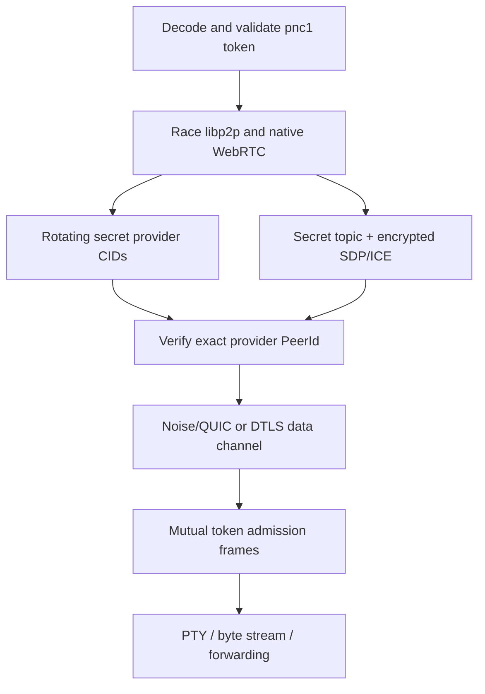

# Private pairing and wire protocol

**English** | [Русский](PAIRING_PROTOCOL.RU.md)

This document is the language-neutral specification for the private pairing
mode introduced by `p2p-netcat`. JavaScript is the first implementation, but
the formats and cryptographic operations are deliberately defined without
JavaScript-specific serialization or runtime behavior so that a Go
implementation can interoperate byte for byte.

## Goals and non-goals

A normal p2p-netcat connection needs a public PeerId. Routing providers can
therefore observe which PeerId is being queried. Private pairing replaces those
public lookup keys with secret-derived rendezvous identifiers and adds a mutual
admission handshake above the selected transport.

The mode provides:

- one copyable token containing the server PeerId, logical port, a 256-bit
  secret, optional relay hints, and optional expiration;
- rotating IPFS provider CIDs that cannot be derived from the PeerId alone;
- encrypted native WebRTC signaling over Nostr relays and WebTorrent trackers;
- mutual proof of token possession before application bytes are accepted;
- signed, versioned route records for future decentralized route exchange;
- the same behavior in Node.js and a static browser PWA.

It does not provide anonymity. A relay or direct peer can still observe network
addresses, connection timing, and traffic volume. Anyone who obtains the token
can read its PeerId and relay hints, discover the server, and pass admission
until the token expires or is replaced.

## CLI workflow

Create a token from the listener's persistent identity:

```bash
p2p-nc token 31337 --identity ~/.config/p2p-netcat/identity.key
```

An optional expiration and one or more relay hints can be embedded:

```bash
p2p-nc token 31337 \
  --identity ~/.config/p2p-netcat/identity.key \
  --expires-in 86400 \
  --relay /dns4/relay.example/tcp/443/wss/p2p/12D3KooWEqeQRAJ61HSv9yMPk8yzjke7NxmTFcvFt4GzwXxzVjXW
```

Start the listener without putting the secret in the process list:

```bash
export P2P_NETCAT_TOKEN='pnc1_...'
p2p-nc -l -i
```

Connect from another CLI:

```bash
export P2P_NETCAT_TOKEN='pnc1_...'
p2p-nc -i
```

The PeerId and logical port may be omitted because both are authenticated token
fields. `--pairing-token-file` is available for a permission-restricted file.
The browser accepts the same token in “Private access and relay”, fills PeerId
and port, and does not persist the token in `localStorage`.

## Connection algorithm



The listener publishes three provider records: previous, current, and next
five-minute window. A client queries those three CIDs in parallel. Clock drift
around a window boundary therefore does not make the peers invisible to one
another. In private mode the CLI and browser do not fall back to
`findPeer(PeerId)`. The CLI disables its global p2p-netcat PubSub
peer-discovery announcement, and the browser Worker does not join that public
discovery topic.

Native WebRTC still races Nostr and WebTorrent signaling. The topic is a stable
secret-derived identifier for the life of the token, while every SDP or ICE
payload is independently protected by AES-256-GCM. A stable topic avoids
breaking long-running WebSocket signaling sessions at a time-window boundary.
The public Trystero compatibility path is disabled when a token is present.

The first transport to authenticate the exact server PeerId then performs the
pairing admission handshake. Application bytes are delivered only after both
sides prove possession of the same secret.

## Pairing token encoding

The textual form is:

```text
pnc1_ || base64url(canonical-CBOR-map)
```

Base64url is RFC 4648 URL-safe encoding without padding. CBOR uses the
deterministic encoding rules from RFC 8949. Indefinite-length values, unknown
keys, NaN, and infinities are rejected.

| Integer key | Type | Meaning |
|---:|---|---|
| `0` | unsigned integer | version, exactly `1` |
| `1` | UTF-8 text | canonical libp2p PeerId |
| `2` | unsigned integer | logical port, `1..65535` |
| `3` | byte string | exactly 32 random bytes |
| `4` | array of text | sorted unique relay multiaddrs, at most 16 |
| `5` | unsigned integer | optional Unix expiration time in seconds |

The token is a bearer credential. It must not be written to logs, URLs, browser
storage, shell history, or source control. Prefer an environment variable or a
file readable only by the user.

## Key derivation

All derived keys use HKDF-SHA-256:

```text
IKM  = token.secret
salt = UTF8("p2p-netcat/pairing/v1")
info = UTF8("p2p-netcat/" || purpose || "/v1")
L    = 32 bytes
```

The allowed purposes are `rendezvous`, `signaling`, `admission`, and
`route-record`. Domain separation is mandatory: a key derived for one purpose
must never be reused for another.

## Rotating rendezvous and provider CID

The default interval is 300 seconds:

```text
epoch = floor(unixMilliseconds / 1000 / 300)
```

For purpose `dht`, `pubsub`, or `signaling`:

```text
message =
  UTF8("p2p-netcat/rendezvous/v1") || 0x00 ||
  UTF8(purpose)                    || 0x00 ||
  UTF8(peerId)                     || 0x00 ||
  UTF8(decimal(service))           || 0x00 ||
  UTF8(decimal(epoch))

rendezvousId = base64url(HMAC-SHA-256(rendezvousKey, message))
```

An IPFS provider key is CIDv1 with the raw codec and SHA-256 multihash:

```text
digest = SHA-256(UTF8("p2p-netcat:rendezvous:v1:" || rendezvousId))
cid    = CIDv1(raw, digest)
```

Provider results are hints, not identities. A consumer must accept addresses
only when the provider PeerId equals the token PeerId, and the transport
handshake must authenticate that PeerId again.

## AEAD envelope

Private signaling uses AES-256-GCM with a fresh random 12-byte nonce and a
128-bit authentication tag. The binary envelope is deterministic CBOR:

| Integer key | Type | Meaning |
|---:|---|---|
| `0` | unsigned integer | envelope version, exactly `1` |
| `1` | byte string | 12-byte nonce |
| `2` | byte string | ciphertext followed by the 16-byte GCM tag |

Signaling metadata—version, secret room identifier, message type, session ID,
sender, optional recipient, and creation time—is authenticated as additional
data. SDP and ICE candidates are inside the ciphertext. A tracker sees a
`pnc-signal-v1:` wrapper instead of the SDP.

## Mutual admission frames

Both frames are exactly 62 bytes and use network byte order:

| Offset | Size | Meaning |
|---:|---:|---|
| `0` | 4 | ASCII `PNCA` |
| `4` | 1 | version `1` |
| `5` | 1 | type: client hello `1`, server acknowledgement `2` |
| `6` | 8 | unsigned Unix time in seconds, big-endian |
| `14` | 16 | random nonce |
| `30` | 32 | HMAC-SHA-256 |

The client MAC input is:

```text
UTF8("p2p-netcat/session-auth/v1") || 0x00 ||
UTF8("client")                     || 0x00 ||
UTF8(peerId)                       || 0x00 ||
UTF8(decimal(service))             || 0x00 ||
UTF8(decimal(timestamp))           || 0x00 ||
clientNonce
```

The server acknowledgement uses role `server` and appends both
`clientNonce || serverNonce`. The server accepts a client timestamp within 120
seconds of its current clock. Implementations should compare MACs in constant
time, abort on any malformed frame, and never pass authentication bytes to the
application stream.

## Signed route record

`p2p-netcat-core` also defines a deterministic CBOR RouteRecord signed by the
libp2p identity key. It contains version, PeerId, monotonic sequence, issue and
expiration time, logical services, direct addresses, relay reservations, and a
capability bitmask for TCP, QUIC, WS, WSS, WebTransport, WebRTC, and relay.

The signed envelope contains:

| Integer key | Meaning |
|---:|---|
| `0` | envelope version `1` |
| `1` | deterministic CBOR record payload |
| `2` | protobuf-encoded libp2p public key |
| `3` | signature over the exact payload bytes |

A verifier derives the PeerId from the included public key, verifies the
signature, requires it to equal the record PeerId and expected PeerId, checks
the requested service, and enforces issue/expiration time. The current release
exposes this codec and validation API; global RouteRecord propagation is not
yet used as an initial discovery dependency.

## Interoperability test vector

This vector uses PeerId
`12D3KooWQ3uxpHgjDKE6vGmvzKS8RPbxUDLwJ7XCLaD6YXdUfbR9`, service `31337`,
secret bytes `00 01 ... 1f`, empty relay hints, and expiration `2000000000`.

```text
token:
pnc1_pgABAXg0MTJEM0tvb1dRM3V4cEhnakRLRTZ2R212ektTOFJQYnhVREx3SjdYQ0xhRDZZWGRVZmJSOQIZemkDWCAAAQIDBAUGBwgJCgsMDQ4PEBESExQVFhcYGRobHB0eHwSABRp3NZQA

rendezvous key:
e8d5fc0873810ff06039af654896909c86521e878d5970c3f8b3fed58df0385f

signaling key:
f4c7b6f69d0024bdfec6c7c017843977f3adb728bb1f398b09e222031d19abeb

admission key:
976b46fe450808bae0694e793fc9db6de10107ffa58b7b0cbfa8e86cb94a3b57

route-record key:
7fe47fb8573ec1e37980a3621d29cf2a7f8f600ab41663821a87280b15070fd4

dht rendezvous, epoch 12345:
9mtMRyxbxPkVQlj7WJW9oCXuVBlgtkxzj9z0F0H8gW0

provider CID:
bafkreihzwnotx7weylzypbxqzsogwwec44rq6ujft6ewn4lh3jjdscylgi

AES-GCM envelope for UTF8("hello"), nonce 000102030405060708090a0b,
additional data UTF8("vector-aad"):
a30001014c000102030405060708090a0b02556e5682c115e1b4ce0fe7930b863d097a7734a2b530

client hello, timestamp 1700000000, nonce 000102030405060708090a0b0c0d0e0f:
504e43410101000000006553f100000102030405060708090a0b0c0d0e0ffa6363937e457a4bad2b60a5d0ab571b842cd30db93d77d613aca8a0208b5e23

server acknowledgement, nonce f0f1f2f3f4f5f6f7f8f9fafbfcfdfeff:
504e43410102000000006553f100f0f1f2f3f4f5f6f7f8f9fafbfcfdfeffc0c3fb8250fd6fae4e1e58520ed5048f7da7dec31f0bf355c1d0c4e8c3910b61
```

## Go implementation boundary

The future Go port should preserve this protocol and replace only platform
adapters. A practical package split is:

```text
protocol/pairing      token, HKDF, rendezvous, AEAD
protocol/admission    fixed frames and stream handshake
protocol/routerecord  deterministic CBOR and identity signatures
discovery             DHT providers, delegated routing, PubSub
transport             libp2p, native WebRTC, relay
session               raw stream, PTY, forwarding, SOCKS
cmd/p2p-nc            CLI parsing and lifecycle
```

Use explicit `[]byte`, `uint64`, and big-endian operations at protocol
boundaries. Keep clocks, random sources, routing clients, and transports behind
small interfaces so deterministic vectors and failure tests do not require a
live network. Do not serialize Go structs directly: construct integer-keyed
CBOR maps and require canonical encoding. Reject unknown protocol versions and
fields instead of silently accepting them.
