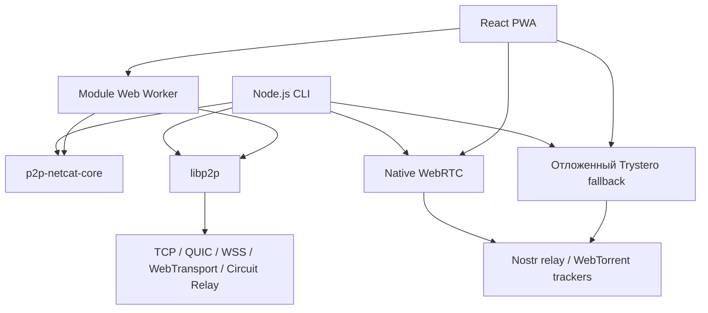

# Контекст проекта p2p-netcat

[English](PROJECT_CONTEXT.md) | **Русский**

> Последняя проверка: 2026-07-27. Базовый коммит реализации: `3e41c0a` до
> добавления этого документа. Если документ расходится с исполняемым кодом,
> манифестами пакетов или тестами, источником истины считаются код и тесты; после
> этого нужно обновить обе языковые версии документа.

Это документ для быстрой передачи проекта разработчикам и языковым моделям. Он
фиксирует назначение продукта, текущую реализацию, важные решения, именование
пакетов, алгоритмы подключения, границы безопасности, команды проверки и
незавершённые задачи. Более подробное описание протокола находится в
[ARCHITECTURE.RU.md](ARCHITECTURE.RU.md), а межъязыковые форматы приватного
доступа и граница Go-порта — в
[PAIRING_PROTOCOL.RU.md](PAIRING_PROTOCOL.RU.md).

## 1. Краткое описание

`p2p-netcat` — JavaScript-инструмент в духе netcat, который адресует удалённый
сервис парой:

```text
PeerId + логический порт
```

вместо:

```text
IP-адрес + порт операционной системы
```

Listener имеет постоянный Ed25519-ключ и поэтому стабильный libp2p PeerId.
Логический порт преобразуется в версионированный протокол приложения:

```text
/p2p-netcat/1.0.0/{логическийПорт}
```

Проект содержит:

- Node.js CLI, публикуемый как `p2p-netcat`, с командами `p2p-nc` и `pnc`;
- общую browser-safe библиотеку `p2p-netcat-core`;
- `p2p-netcat/core` — тонкий реэкспорт `p2p-netcat-core`;
- `p2p-netcat/relay` — Node-only API программного Circuit Relay;
- полностью статическую React/Vite PWA, публикуемую как `p2p-netcat-web` и
  размещённую на GitHub Pages.

У браузерного клиента нет backend, SSR, API routes, серверной базы данных и
серверных скриптов. IndexedDB используется только как локальный кеш маршрутов.
Публичная инфраструктура IPFS/libp2p, Nostr relay, WebTorrent trackers и
STUN-серверы прозрачно используются для discovery и signaling. Ни одна из этих
сторонних систем не гарантирует, что любые два пира всегда смогут соединиться.

## 2. Текущее состояние релизов и развёртывания

Следующие версии были последним набором, подтверждённым в публичном npm
registry 2026-07-27:

| Артефакт | Версия | npm-пакет или URL |
|---|---:|---|
| CLI и Node.js API | `3.1.0` | `p2p-netcat` |
| Общая browser-safe библиотека | `0.3.0` | `p2p-netcat-core` |
| Собранная статическая PWA | `0.4.0` | `p2p-netcat-web` |
| Английская production PWA | — | <https://santaklouse.github.io/p2p-netcat/> |
| Русская production PWA | — | <https://santaklouse.github.io/p2p-netcat/?lang=ru> |

Текущие исходные манифесты являются release candidate для CLI `3.2.0`, core
`0.4.0` и web `0.5.0`. Нельзя называть эти версии опубликованными, пока после
явно запрошенного релиза не проверен npm registry.

Канонический репозиторий:
<https://github.com/santaklouse/p2p-netcat>.

Push в ветку `main` запускает `.github/workflows/pages.yml`. CI проверяет CLI и
core, выполняет TypeScript-проверку, собирает статическую PWA с правильным base
path репозитория, тестирует результат и публикует `web/dist` в GitHub Pages.

## 3. Обязательные требования проекта

Будущие изменения должны сохранять эти ограничения, пока владелец явно не
изменит направление продукта:

1. Использовать JavaScript/TypeScript и ESM. Поддерживается Node.js 22 или
   новее; для релизных команд рекомендуется Node.js 22.13 или новее.
2. Веб-клиент должен оставаться полностью статическим и размещаться на GitHub
   Pages. Runtime-серверные скрипты запрещены.
3. Основной веб-интерфейс — английский. Полный русский интерфейс выбирается
   параметром `?lang=ru` и доступен по ссылке в шапке.
4. Все комментарии в коде должны быть на английском. Пользовательские строки
   CLI пока могут быть русскими; это строки, а не комментарии.
5. Документация поддерживается английскими и русскими парами. При изменении
   поведения нужно обновлять оба файла.
6. Ручной WebSocket/WSS relay multiaddr в браузере необязателен и по умолчанию
   пуст. Основной путь — автоматический discovery и native WebRTC.
7. Аутентификация PeerId, ограниченный backpressure, семантика EOF и
   восстановление PTY — требования корректности, а не необязательное улучшение.
8. Нельзя утверждать, что discovery только по PeerId надёжен на 100%. Пир может
   быть offline, находиться за строгим NAT, публичная signaling-инфраструктура
   может быть недоступна, а relay reservation может отсутствовать.
9. Trystero — отложенный compatibility fallback, а не основной транспорт.
   Нельзя удалять его до прохождения реальной матрицы тестирования из
   [WEBRTC_MIGRATION.RU.md](WEBRTC_MIGRATION.RU.md).
10. Нужно сохранять посторонние изменения в working tree. Для воспроизводимой
    проверки используются `npm ci` и зафиксированные lockfile.
11. Будущая реализация будет написана на Go. Поэтому новое кроссплатформенное
    поведение должно использовать версионированные byte formats, стандартную
    криптографию, явную ширину и byte order чисел, детерминированные test
    vectors и небольшие platform adapters, а не соглашения JavaScript runtime.

Текущий release candidate добавляет приватный pairing:
canonical token `pnc1_`, вращающиеся DHT provider CID, зашифрованный native
signaling, взаимный stream admission, примитивы подписанного RouteRecord и
одинаковая схема клиента в CLI и браузере. Trystero остаётся только для обычного
режима PeerId; при наличии token он никогда не запускается.

## 4. Именование пакетов и импортов

Текущее именование намеренно гибридное:

| Импорт или пакет | Среда | Назначение |
|---|---|---|
| `p2p-netcat` | Node.js | CLI-пакет и Node-specific реализация |
| `p2p-netcat/core` | Browser и Node.js | Subpath, реэкспортирующий весь `p2p-netcat-core` |
| `p2p-netcat/relay` | Только Node.js | `startRelay()` и типы жизненного цикла relay |
| `p2p-netcat-core` | Browser и Node.js | Отдельный browser-safe общий пакет |
| `p2p-netcat-web` | Статические файлы | Собранный `dist`, не требующий Node-процесса |

Не следует считать `p2p-netcat/core` ещё не выполненным переименованием
каталога. Это уже работающий subpath основного пакета, а независимо публикуемый
`p2p-netcat-core` одновременно остаётся частью публичного API. Корневой пакет
зависит от отдельного core-пакета, а `src/core.js` только реэкспортирует его.

Порядок публикации определяется зависимостями:

```bash
npm publish ./packages/core --access public
npm publish . --access public
npm publish ./web --access public
```

## 5. Архитектура верхнего уровня



Ответственность слоёв:

- `p2p-netcat-core` содержит платформенно-независимую валидацию, protocol ID,
  relay dial plan, рейтинг адресов, PTY framing, native WebRTC framing,
  аутентификацию, signaling adapters, flow control, keepalive и reconnect.
- Node.js-слой управляет identity на диске, stdin/stdout, TCP/QUIC listener,
  публикацией DHT provider record, выполнением команд, TCP forwarding, SOCKS,
  Tor, `node-pty`, relay-server режимом и жизненным циклом процесса.
- Browser Worker управляет browser libp2p, кешем маршрутов IndexedDB, delegated
  routing, DHT-запросами, гонкой транспортов и бинарным RPC с main thread.
- React управляет формами, состоянием, журналом, передачей файлов,
  локализацией и xterm-виджетом.
- Service Worker кеширует и обновляет оболочку PWA. Он никогда не переносит
  P2P-трафик приложения.

## 6. Постоянные идентификаторы и значения по умолчанию

| Параметр | Текущее значение |
|---|---|
| Имя приложения | `p2p-netcat` |
| Логический порт по умолчанию | `31337` |
| Префикс протокола | `/p2p-netcat/1.0.0` |
| Тема PubSub discovery | `io.github.santaklouse.p2p-netcat.peer-discovery.v1` |
| Интервал PubSub-объявлений | `10 000 мс` |
| WebRTC application ID | `io.github.santaklouse.p2p-netcat.v1` |
| WebRTC reconnect grace | `120 000 мс` |
| Максимальный PTY frame | `1 048 576 байт` |
| Таймаут CLI-подключения | `60 секунд` |
| Таймаут формы браузера | `30 секунд` |
| Срок кеша браузерного маршрута | `24 часа` |
| Попытка кешированного маршрута | `6 секунд` |
| Задержка native → Trystero | До `4 секунд`; меньше при очень малом общем таймауте |

Постоянная identity listener обычно находится здесь:

```text
~/.config/p2p-netcat/identity.key
```

Каталог создаётся с правами `0700`, приватный ключ записывается с правами
`0600`. CLI-клиенты используют временный ключ, если не передан `--identity`.
Browser identity сейчас также временная и живёт только вместе со страницей.

## 7. Алгоритмы подключения

### 7.1 CLI listener

1. Проверить логический порт.
2. Загрузить или создать постоянный Ed25519-ключ.
3. Создать Node.js libp2p-узел с TCP, QUIC v1, WebSocket, Circuit Relay v2,
   Noise, Yamux, identify, ping, mDNS, bootstrap, подписанным GossipSub
   discovery и Amino DHT.
4. Зарегистрировать handler `/p2p-netcat/1.0.0/{port}`.
5. Напечатать PeerId и доступные multiaddr в stderr.
6. Опубликовать CID PeerId как IPFS DHT provider record. Публикация имеет
   таймаут 60 секунд, повторяется через 5 секунд и обновляется каждые 6 часов.
7. Подключить аутентифицированный входящий stream к stdin/stdout, команде,
   TCP-назначению, SOCKS или PTY в зависимости от режима.
8. Завершиться после обычной сессии или продолжать с `-k`; PTY и forwarding
   используют предусмотренную для них многосессионную модель.

### 7.2 CLI client

Для обычного libp2p-пути:

1. Полный target multiaddr пропускает discovery.
2. Явный `--relay` строит адрес
   `relay/p2p-circuit/p2p/targetPeerId`.
3. Иначе сначала проверяются известные адреса в peer store.
4. Ищется provider record для CID target PeerId.
5. Затем выполняется Amino DHT `findPeer`.
6. Discovery повторяется каждые 500 мс до общего таймаута.
7. Открывается протокол, соответствующий логическому порту.

Для обычного одиночного stream CLI запускает гонку libp2p и native WebRTC.
Native Nostr и WebTorrent signaling стартуют сразу; legacy Trystero обычно
запускается через четыре секунды, если native WebRTC ещё не победил. При меньшем
общем таймауте задержка сокращается до его четверти, но не ниже 500 мс. Первый
аутентифицированный транспорт отменяет остальные.

Client `-p` forwarding намеренно использует мультиплексированные libp2p streams,
а не текущий одно-поточный WebRTC adapter.

### 7.3 Браузер с пустым полем relay

Браузер запускает две основные ветки параллельно.

Worker/libp2p:

1. Попробовать не устаревший IndexedDB-маршрут в течение шести секунд.
2. Принимать подписанные PubSub-объявления в peer store во время discovery.
3. Загрузить `web/public/network-config.json`.
4. Запросить все delegated HTTP Routing V1 endpoints по PeerId и provider CID.
5. При необходимости запросить provider record и выполнить `findPeer` через
   Amino DHT.
6. Оставить только доступные браузеру WSS/WebTransport-адреса. HTTPS запрещает
   небезопасный WS.
7. Добавить необязательные relay-маршруты из статического конфига.
8. Запустить все `dialProtocol()` одновременно и выбрать первый через
   `Promise.any`.
9. Сохранить победивший адрес на 24 часа.

WebRTC:

1. Получить детерминированный room из target PeerId и логического порта.
2. Запустить собственные Nostr и WebTorrent signaling adapters.
3. Создать и аутентифицировать прямые `RTCDataChannel` candidates.
4. После отложенного интервала, обычно через четыре секунды, запустить Trystero
   только как compatibility fallback.

`BrowserP2PClient` выбирает первый аутентифицированный libp2p, native WebRTC или
legacy WebRTC канал. Все ветки используют таймаут из формы.

### 7.4 Браузер с явным relay

Введённый relay multiaddr пропускает автоматический discovery и WebRTC race.
Worker проверяет:

- наличие PeerId relay в адресе;
- транспорт WS или WSS;
- обязательный WSS для HTTPS-страницы.

После этого строится и открывается Circuit Relay destination. Это аварийный или
детерминированный fallback, а не обязательное поле по умолчанию.

## 8. Роли discovery и transport технологий

| Технология | Роль | Чего она не гарантирует |
|---|---|---|
| mDNS | LAN discovery для Node.js peers | Internet discovery |
| Подписанный GossipSub peer discovery | Дополнительные объявления адресов | Bootstrap или глобальный rendezvous |
| IPFS Amino DHT | Provider/peer lookup | Browser-compatible адрес или relay capacity |
| Delegated HTTP Routing V1 | Удобный браузеру PeerId/provider query | Достижимость возвращённого адреса |
| Nostr relay | Подписанный native WebRTC SDP signaling | Relay payload или SLA |
| WebTorrent trackers | Native/legacy WebRTC rendezvous | Relay payload или SLA |
| STUN | Определение NAT mapping для WebRTC | TURN-подобный relay трафика |
| Circuit Relay v2 | Relay зашифрованного libp2p соединения | Анонимность или бесплатная публичная capacity |
| TURN | Возможный WebRTC fallback | Сейчас не настроен проектом |

Общая ICE-конфигурация содержит:

```text
stun:stun.l.google.com:19302
stun:stun1.l.google.com:19302
stun:stun2.l.google.com:19302
stun:stun3.l.google.com:19302
stun:stun4.l.google.com:19302
stun:stun.counterpath.com:3478
stun:stun.sipgate.net:3478
stun:stun.voipbuster.com:3478
stun:stun.internetcalls.com:3478
```

Текущий статический browser config:

```json
{
  "delegatedRouting": [
    "https://delegated-ipfs.dev/routing/v1"
  ],
  "relays": []
}
```

## 9. Native WebRTC и миграция с Trystero

Собственная native WebRTC-реализация уже является основным WebRTC-путём. Core
содержит:

- `WebRtcStream` с backpressure, EOF, keepalive и reconnect;
- надёжный упорядоченный бинарный data-channel protocol;
- Nostr signaling adapter с подписанными короткоживущими offer, answer и
  trickle-ICE candidate events;
- WebTorrent tracker adapter с ограниченным пулом offers и адресными answers;
- controllers для client и listener endpoints;
- Ed25519-доказательство владения точным запрошенным PeerId сервера.

Последовательность аутентификации:

1. Клиент отправляет случайный 32-байтный challenge.
2. Listener подписывает domain-separated transcript постоянным libp2p
   Ed25519-ключом.
3. Клиент вычисляет PeerId из возвращённого public key и проверяет подпись и
   точное совпадение target PeerId.
4. Listener открывает application stream только после `AUTH_READY`.

Trystero пока остаётся в Node.js и web dependencies. Legacy adapters находятся
в `src/trystero.js` и `web/app/webrtc-client.ts`. Удаление ожидает длительного
тестирования browser/OS/NAT/background/high-output совместимости. Нельзя
описывать миграцию как завершённую. Опция CLI `--no-trystero`,
native-only-переключатель PWA и `scripts/webrtc-soak.js` проверяют путь без этой
зависимости до её удаления. Еженедельный workflow для Linux/macOS покрывает
локальные сценарии настоящего WebRTC/data channel, но не реальные публичные
сервисы, browsers и сочетания NAT.

## 10. Data protocols, flow control и восстановление

### Обычный режим

Обычные application data — бинарно-прозрачный byte stream без JSON и
line-framing. Передача в обе стороны идёт одновременно. EOF закрывает только
write side, поэтому peer может продолжать возвращать данные.

### Интерактивный PTY

PTY использует общие для CLI и браузера frames:

```text
1 байт type + 4 байта payload length + payload
```

Текущие типы: data (`0`) и resize (`1`). В браузере нужно включить Interactive
PTY до подключения к listener с `-i`; обычный и PTY режимы намеренно имеют
разное wire encoding внутри одного logical-port protocol.

### WebRTC framing

Native WebRTC data-channel messages содержат версию `0x02`, frame type и
binary payload. Управляющие сообщения:

```text
flow:1
ack:<bytes>
resume
ping
pong
eof
abort
```

### Backpressure

Ограниченный output pipeline является обязательной частью дизайна:

- сервер останавливает `node-pty` при очереди 512 КиБ и продолжает при 128 КиБ;
- libp2p writers учитывают `onDrain()`;
- WebRTC после `flow:1` ограничивает неподтверждённые данные 256 КиБ;
- browser Worker перестаёт читать при 512 КиБ ожидающих UI-данных и продолжает
  ниже 128 КиБ;
- main thread подтверждает Worker block только после завершения xterm
  `Terminal.write()`.

Интерактивный browser output не накапливается в downloadable response buffer.
Историю сохраняет только ограниченный scrollback xterm.

### Reconnection

Неожиданное закрытие native WebRTC data channel не считается немедленным PTY
EOF. Тот же `WebRtcStream` и серверный PTY ждут до 120 секунд. Новый data
channel с той же client-session identity можно привязать к существующему
stream. Явный EOF, abort, пользовательское завершение или конец grace period
закрывают сессию.

## 11. CLI и совместимость с gs-netcat

Основной синтаксис:

```bash
p2p-nc [options] [PeerId|multiaddr] [logical-port]
```

Важные режимы:

| Опция | Текущее поведение |
|---|---|
| `-l` | Listener mode |
| `-k` | Продолжать принимать обычные сессии |
| `-w SECONDS` | Discovery/connection timeout; явное значение также задаёт inactivity timeout |
| `-d HOST` | Server-side TCP destination; требует listener `-p` |
| `-p PORT` | Destination port listener или локальный forwarding port клиента |
| `-q` | Скрыть диагностику p2p-netcat в stderr |
| `-S` | Удалённый SOCKS4/4a/5 CONNECT server |
| `-T` | Relay-only client под изолированным `torsocks` |
| `-i` | Интерактивный PTY login shell/raw terminal client |
| `-z` | Проверка подключения без передачи данных |
| `-e COMMAND` | Подключить listener stream к команде |
| `-u` | Распознаётся, но намеренно отклоняется; UDP mode не реализован |
| `--transport-port` | Локальный TCP/QUIC port libp2p; прежнее значение `-p` |
| `-I, --identity` | Файл постоянной identity; прежнее короткое значение `-i` |
| `--relay` | Явный Circuit Relay; можно повторять |
| `--no-dht`, `--no-mdns`, `--no-pubsub`, `--no-quic`, `--no-webrtc` | Отключение отдельных веток |
| `--no-trystero` | Оставить native WebRTC, но отключить отложенный legacy fallback |
| `-v` | Подробная диагностика discovery, signaling, transport, ICE и reconnect |

Основные ограничения:

- `-i` нельзя использовать вместе с `-e`, `-S` или клиентским `-p`;
- `-S` несовместим с серверным `-d/-p`;
- `-T` работает только в client mode, требует явный TCP/WS/WSS relay и
  отключает прямые/UDP discovery paths;
- `-q` имеет приоритет над verbose diagnostics;
- SOCKS BIND, SOCKS UDP ASSOCIATE, SOCKS authentication и UDP forwarding не
  реализованы.

## 12. Browser PWA

Веб-приложение использует React, TypeScript, Vite, xterm, module Web Worker и
сгенерированный Service Worker.

Возможности интерфейса:

- форма PeerId и logical port;
- необязательное advanced-поле relay;
- connection timeout;
- отправка обычного текста;
- потоковая отправка файла;
- скачивание принятых байтов;
- явный EOF;
- переключатель отображения отправленного текста в transcript;
- интерактивный xterm PTY с передачей клавиатуры и resize;
- traffic counters и локализованный event log;
- установка PWA и offline-запуск оболочки приложения.

Языки:

- `/p2p-netcat/` — английский;
- `/p2p-netcat/?lang=ru` — русский;
- обе версии используют один React component и `web/app/i18n.ts`;
- английский UI переводит текущие русские transport diagnostics на границе
  отображения;
- HTML/PWA metadata по умолчанию английские, а runtime metadata переключаются
  для русского языка.

HTTP URL GitHub Pages заменяется на HTTPS до запуска приложения, поскольку Web
Crypto, Service Worker и browser P2P API требуют secure context.

## 13. Программный relay API

Node.js-приложение может запустить relay без дочернего CLI-процесса:

```js
import { startRelay } from 'p2p-netcat/relay'

const relay = await startRelay({
  identityPath: './data/p2p-netcat-relay.key',
  localPort: 9090,
  websocketPort: 9091,
  enableMdns: false,
  enablePubsub: true,
  enableQuic: true
})

console.log(relay.peerId)
console.log(relay.addresses)

await relay.stop()
```

Handle содержит запущенный libp2p node, путь identity, PeerId, текущие addresses
и идемпотентную функцию `stop()`. Вызывающее приложение само управляет signals
и завершением процесса.

HTTPS-браузеру нужен публичный WSS relay multiaddr. Сам relay слушает обычный
WS; production WSS обычно завершается на reverse proxy или CDN.

## 14. Граница безопасности

Проект аутентифицирует PeerId сервера и шифрует транспорт:

- Noise защищает libp2p-соединения;
- QUIC дополнительно использует transport TLS 1.3;
- native/legacy WebRTC использует SCTP data channel, защищённый DTLS, и явный
  подписанный PeerId challenge;
- Circuit Relay переносит уже зашифрованное libp2p-соединение.

Discovery не является trust anchor. DHT nodes, routing endpoints, Nostr relay,
trackers, STUN servers и relay operators могут видеть часть metadata: addresses,
lookup topics, timing, SDP, PeerIds или traffic volume.

Сейчас нет client allowlist или application authorization. Любой peer, знающий
PeerId listener и logical port, может попытаться использовать `-e`, `-i`, `-d`
или `-S`. Привилегированные режимы нужно запускать от изолированного
непривилегированного пользователя и ограничивать host firewall.

Tor `-T` запрещает прямой fallback, требуя relay-only запуск под torsocks. Он не
скрывает PeerIds, timing, traffic volume или application destinations сервера
от всех участников.

## 15. Карта репозитория

| Путь | Ответственность |
|---|---|
| `bin/p2p-nc.js` | Executable entrypoint и проверка версии Node |
| `src/cli.js` | CLI definitions, validation и lifecycle |
| `src/node.js` | Создание Node.js libp2p |
| `src/identity.js` | Постоянная Ed25519 identity |
| `src/discovery.js` | DHT publication и PeerId resolution |
| `src/pairing.js` | Загрузка token в CLI и проверка scope |
| `src/session.js` | Bidirectional stream и command handling |
| `src/forwarding.js` | TCP forwarding и SOCKS parsing |
| `src/pty.js` | PTY listener/client и backpressure |
| `src/tor.js` | Tor validation и torsocks re-exec |
| `src/webrtc.js` | Native-first Node WebRTC orchestration |
| `src/trystero.js` | Legacy Node Trystero compatibility |
| `src/relay.js` | Programmatic Circuit Relay |
| `src/core.js` | Реэкспорт `p2p-netcat/core` |
| `packages/core/src/index.js` | Constants, validation, relay plans и PTY codec |
| `packages/core/src/native-webrtc.js` | WebRTC stream и wire primitives |
| `packages/core/src/signaling.js` | Native Nostr/tracker signaling |
| `packages/core/src/native-endpoint.js` | Native WebRTC endpoint controller |
| `packages/core/src/pairing.js` | Canonical token, HKDF, rendezvous и AEAD |
| `packages/core/src/session-auth.js` | Фиксированные взаимные admission frames |
| `packages/core/src/authenticated-stream.js` | Stream wrapper с admission |
| `packages/core/src/route-record.js` | Signed deterministic RouteRecord codec |
| `scripts/webrtc-soak.js` | Локальные real-WebRTC soak-сценарии и JSON reports |
| `web/app/page.tsx` | Основной React UI |
| `web/app/i18n.ts` | English/Russian UI и diagnostic localization |
| `web/app/p2p-client.ts` | Transport race и Worker RPC client |
| `web/app/p2p.worker.ts` | Browser libp2p, discovery, routing и cache |
| `web/app/native-webrtc-client.ts` | Browser native WebRTC adapter |
| `web/app/webrtc-client.ts` | Browser legacy Trystero fallback |
| `web/app/browser-terminal.tsx` | xterm PTY widget |
| `web/public/network-config.json` | Delegated routing и static relay config |
| `web/vite.config.ts` | Static base path, PWA manifest и Workbox |
| `.github/workflows/pages.yml` | CLI/core tests, PWA build и Pages deploy |
| `.github/workflows/webrtc-soak.yml` | Scheduled/manual native WebRTC matrix для Linux и macOS |

## 16. Разработка и проверка

В shell должна использоваться актуальная Node.js. На компьютере с несколькими
установками Node всегда проверяйте `node --version` до запуска `npm`.

Корневые проверки:

```bash
npm ci
npm run lint
npm test
npm run soak:webrtc -- --profile smoke
```

Web:

```bash
npm --prefix web ci
npm --prefix web run lint
npm --prefix web test
```

Локальная разработка web:

```bash
npm --prefix web run dev
```

Production-подобный preview:

```bash
npm --prefix web run build
npm --prefix web run preview
```

Проверка release artifacts:

```bash
npm pack ./packages/core --dry-run
npm pack . --dry-run
npm pack ./web --dry-run
```

Корень использует npm workspace для `packages/core`. Репозиторий содержит
`.npmrc` с `install-links=true`; web lockfile разрешает локальный core-пакет,
поэтому чистая CI-сборка не зависит от произвольной установленной копии.

## 17. Карта документации

| Документ | Назначение |
|---|---|
| `README.md` / `README.RU.md` | Обзор продукта и основные примеры |
| `docs/PROJECT_CONTEXT.md` / `.RU.md` | Быстрая полная передача контекста |
| `docs/ARCHITECTURE.md` / `.RU.md` | Подробные алгоритмы и data flow |
| `docs/WEBRTC_MIGRATION.md` / `.RU.md` | Native WebRTC и условия удаления Trystero |
| `docs/GS_NETCAT_COMPAT.md` / `.RU.md` | Точная семантика `-d -p -q -S -T -i` |
| `docs/INSTALLATION.md` / `.RU.md` | Установка и первое подключение |
| `docs/RELAY_API.md` / `.RU.md` | Programmatic relay API |
| `docs/PUBLISHING.md` / `.RU.md` | Порядок npm-релиза и проверки |
| `web/README.md` / `.RU.md` | Static PWA, discovery и GitHub Pages |
| `packages/core/README.md` / `.RU.md` | Public API общей библиотеки |

## 18. Известные ограничения и дальнейшая работа

Текущие ограничения:

- нет гарантии подключения только по PeerId;
- нет встроенного TURN;
- нет client authorization/allowlist;
- нет netcat-style UDP datagram mode;
- нет SOCKS authentication, BIND и UDP ASSOCIATE;
- нет gs-netcat `Ctrl-e c` command console и PTY `get`/`put`;
- browser identity не сохраняется;
- публичные discovery/signaling системы не имеют SLA проекта;
- Trystero dependencies остаются на период совместимости;
- полностью выгруженная или перезагруженная browser tab не может сохранить
  находящуюся в памяти identity PTY-сессии.

Области с наибольшим риском регрессии:

1. длительный большой PTY output и backpressure;
2. reconnect в background browser tab;
3. cross-country или restrictive-NAT discovery;
4. дублирующие native/legacy WebRTC channels;
5. порядок half-close/EOF;
6. secure context и WSS enforcement в браузере;
7. разрешение npm packages и subpath exports.

До удаления Trystero нужно провести длительные тесты browser → Linux, macOS →
Linux, Chrome/Firefox/Safari, разных NAT, sleep/wake, background tabs,
многочасового high-volume PTY, повторных reconnect и совместимости старых и
новых опубликованных версий.

## 19. Checklist передачи для будущих агентов

Перед изменением поведения:

1. Прочитать этот файл и специализированный документ нужной области.
2. Проверить реальный package manifest и код; не полагаться на предположение об
   именовании.
3. Выполнить `git status` и сохранить пользовательские изменения.
4. Определить, затрагивает ли изменение CLI, core, web или все слои.
5. По возможности размещать общую browser-safe логику в `packages/core`.
6. Сохранять static-only границу web.
7. Добавлять тесты безопасности, framing, backpressure и failure paths.
8. Запускать root и web checks на Node.js 22.
9. Одновременно обновлять английскую и русскую документацию.
10. Писать все новые комментарии к коду на английском.
11. При публикации увеличивать immutable npm versions и публиковать core раньше
    использующих его пакетов.
12. При deploy проверять GitHub Pages workflow и оба языковых URL.

## 20. Факты, которые нельзя трактовать неверно

- PeerId идентифицирует криптографический peer; это не маршрут и он не содержит
  текущий IP-адрес.
- STUN — не TURN и не переносит application traffic.
- IPFS HTTP gateway — не transport p2p-netcat и не Circuit Relay.
- PubSub discovery является дополнительным и требует уже подключённую
  совместимую mesh; это не глобальный rendezvous.
- Браузер не может подключаться к обычным Node.js TCP или QUIC multiaddr.
- Статическое приложение GitHub Pages может использовать WebSocket, WebRTC,
  DHT и delegated routing из browser JavaScript; «без backend» не означает
  «только offline».
- Trystero ещё присутствует, но только как отложенный compatibility fallback.
- `p2p-netcat/core` и `p2p-netcat-core` — одновременно действующие API.
- `p2p-netcat/relay` работает только в Node.js.
- `-p` теперь означает forwarding port; локальный transport port libp2p —
  `--transport-port`.
- `-i` теперь означает interactive PTY; постоянная identity использует `-I`.
