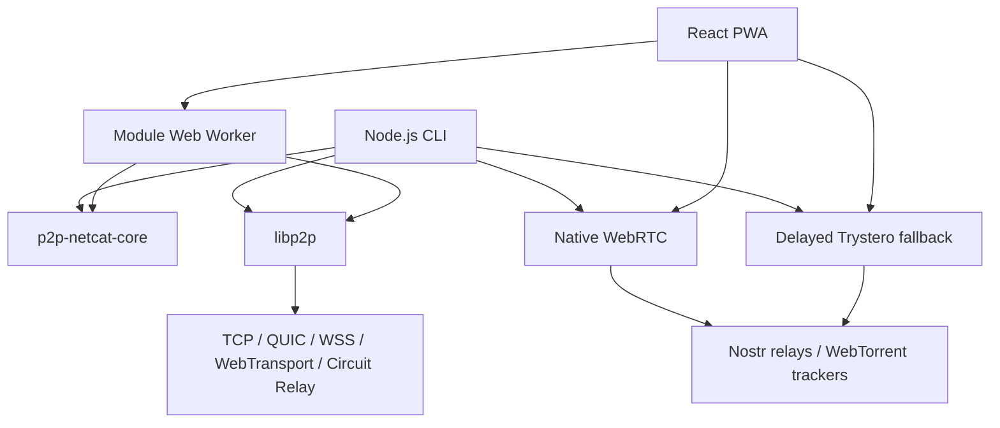

# p2p-netcat project context

**English** | [Русский](PROJECT_CONTEXT.RU.md)

> Last verified: 2026-07-27. Implementation baseline: `3e41c0a` before this
> document was added. If this document conflicts with executable source,
> package manifests, or tests, treat the source and tests as authoritative and
> update both language versions of this document.

This is the fast handoff document for maintainers and language models. It
captures the product intent, current implementation, important decisions,
package naming, connection algorithms, security boundaries, verification
commands, and unfinished work. Detailed protocol explanations remain in
[ARCHITECTURE.md](ARCHITECTURE.md). The language-neutral private access formats
and Go port boundary are specified in
[PAIRING_PROTOCOL.md](PAIRING_PROTOCOL.md).

## 1. Executive summary

`p2p-netcat` is a JavaScript netcat-like tool that addresses a remote service
with:

```text
PeerId + logical port
```

instead of:

```text
IP address + operating-system port
```

The listener has a persistent Ed25519 key and therefore a stable libp2p
PeerId. The logical port maps to a versioned application protocol:

```text
/p2p-netcat/1.0.0/{logicalPort}
```

The project contains:

- a Node.js CLI, published as `p2p-netcat`, with `p2p-nc` and `pnc` binaries;
- a browser-safe shared library, published as `p2p-netcat-core`;
- `p2p-netcat/core`, a thin re-export of `p2p-netcat-core`;
- `p2p-netcat/relay`, a Node-only programmatic Circuit Relay API;
- a fully static React/Vite PWA, published as `p2p-netcat-web` and deployed to
  GitHub Pages.

The browser has no backend, SSR, API routes, server-side database, or
server-side scripts. It uses IndexedDB only as a local route cache.
Public IPFS/libp2p infrastructure, Nostr relays, WebTorrent trackers, and STUN
servers are used transparently for discovery and signaling. None of these
third-party systems guarantees that two arbitrary peers will always connect.

## 2. Current release and deployment state

The following versions were the last set confirmed on the public npm registry
on 2026-07-27:

| Artifact | Version | npm entry or URL |
|---|---:|---|
| CLI and Node.js API | `3.1.0` | `p2p-netcat` |
| Browser-safe shared library | `0.3.0` | `p2p-netcat-core` |
| Prebuilt static PWA | `0.4.0` | `p2p-netcat-web` |
| English production PWA | — | <https://santaklouse.github.io/p2p-netcat/> |
| Russian production PWA | — | <https://santaklouse.github.io/p2p-netcat/?lang=ru> |

The current source manifests are release candidates for CLI `3.2.0`, core
`0.4.0`, and web `0.5.0`. Do not describe those versions as published until
the npm registry has been checked after an explicit release.

Canonical source repository:
<https://github.com/santaklouse/p2p-netcat>.

The `main` branch triggers `.github/workflows/pages.yml`. CI tests the CLI and
core, checks TypeScript, builds the static PWA with the repository base path,
tests the static output, and deploys `web/dist` to GitHub Pages.

## 3. Non-negotiable project requirements

Future changes should preserve these constraints unless the maintainer
explicitly changes the product direction:

1. Use JavaScript/TypeScript and ESM. The supported runtime is Node.js 22 or
   newer; Node.js 22.13 or newer is recommended for all release commands.
2. The web client must remain fully static and deployable to GitHub Pages.
   Runtime server scripts are not allowed.
3. The default web interface is English. The complete Russian interface is
   selected with `?lang=ru` and linked from the header.
4. All code comments must be in English. User-facing CLI strings may still be
   Russian; those strings are not comments.
5. Documentation is maintained in English/Russian pairs. Update both files
   when changing behavior.
6. A manual WebSocket/WSS relay multiaddr is optional in the browser and empty
   by default. Automatic discovery and native WebRTC are the normal path.
7. PeerId authentication, bounded backpressure, EOF semantics, and PTY
   reconnect behavior are correctness requirements, not optional polish.
8. Do not claim that PeerId-only discovery is 100% reliable. Offline peers,
   restrictive NAT, unavailable public signaling infrastructure, and missing
   relay reservations remain real failure modes.
9. Trystero is a delayed compatibility fallback, not the primary transport.
   Do not remove it until the real-network soak matrix in
   [WEBRTC_MIGRATION.md](WEBRTC_MIGRATION.md) has passed.
10. Preserve unrelated working-tree changes. Use `npm ci` and the committed
    lockfiles for reproducible verification.
11. A future implementation will be written in Go. New cross-platform behavior
    must therefore use versioned byte formats, standard cryptography, explicit
    integer widths and byte order, deterministic test vectors, and small
    platform adapters instead of JavaScript runtime conventions.

The current release candidate adds private pairing:
canonical `pnc1_` tokens, rotating DHT provider CIDs, encrypted native
signaling, mutual stream admission, signed RouteRecord primitives, and the same
client flow in the CLI and browser. Trystero remains available only in ordinary
PeerId mode; token mode never starts it.

## 4. Package and import naming

The naming is intentionally hybrid:

| Import or package | Environment | Meaning |
|---|---|---|
| `p2p-netcat` | Node.js | CLI package and Node-specific implementation |
| `p2p-netcat/core` | Browser and Node.js | Subpath that re-exports all of `p2p-netcat-core` |
| `p2p-netcat/relay` | Node.js only | `startRelay()` and relay lifecycle types |
| `p2p-netcat-core` | Browser and Node.js | Standalone browser-safe shared package |
| `p2p-netcat-web` | Static files | Prebuilt `dist` directory; no runtime Node process |

Do not reinterpret `p2p-netcat/core` as a directory rename that has not yet
happened. It is a working package subpath today, while the independently
published `p2p-netcat-core` package also remains part of the public API. The
root package depends on the standalone core package, and `src/core.js` simply
re-exports it.

Publish in dependency order:

```bash
npm publish ./packages/core --access public
npm publish . --access public
npm publish ./web --access public
```

## 5. High-level architecture



Responsibilities:

- `p2p-netcat-core` owns platform-neutral validation, protocol IDs, relay dial
  planning, address ranking, PTY framing, native WebRTC wire framing,
  authentication, signaling adapters, stream flow control, keepalive, and
  reconnect primitives.
- The Node.js layer owns identities on disk, stdin/stdout, TCP/QUIC listeners,
  DHT provider publication, command execution, TCP forwarding, SOCKS, Tor,
  `node-pty`, relay-server mode, and process lifecycle.
- The browser Worker owns browser libp2p, IndexedDB route caching, delegated
  routing, DHT queries, transport races, and binary RPC with the main thread.
- React owns forms, state, the event log, file transfer controls, localization,
  and the xterm widget.
- The Service Worker caches and updates the application shell. It never carries
  P2P application traffic.

## 6. Stable identifiers and defaults

| Item | Current value |
|---|---|
| Application name | `p2p-netcat` |
| Default logical port | `31337` |
| Protocol prefix | `/p2p-netcat/1.0.0` |
| PubSub discovery topic | `io.github.santaklouse.p2p-netcat.peer-discovery.v1` |
| PubSub announcement interval | `10,000 ms` |
| WebRTC application ID | `io.github.santaklouse.p2p-netcat.v1` |
| WebRTC reconnect grace | `120,000 ms` |
| PTY frame maximum | `1,048,576 bytes` |
| CLI connection timeout | `60 seconds` |
| Browser UI default timeout | `30 seconds` |
| Browser route-cache lifetime | `24 hours` |
| Browser cached-route dial budget | `6 seconds` |
| Native-to-Trystero fallback delay | Up to `4 seconds`; shorter for a very small overall timeout |

The persistent listener identity normally lives at:

```text
~/.config/p2p-netcat/identity.key
```

The directory is created with mode `0700`, and the private key is written with
mode `0600`. CLI clients are ephemeral unless `--identity` is supplied.
Browser identities are currently ephemeral across page lifetimes.

## 7. Connection algorithms

### 7.1 CLI listener

1. Validate the logical port.
2. Load or create the persistent Ed25519 key.
3. Create the Node.js libp2p node with TCP, QUIC v1, WebSocket, Circuit Relay
   v2, Noise, Yamux, identify, ping, mDNS, bootstrap, signed GossipSub
   discovery, and Amino DHT.
4. Register the `/p2p-netcat/1.0.0/{port}` handler.
5. Print PeerId and usable multiaddrs to stderr.
6. Publish the PeerId CID as an IPFS DHT provider record. Publication times out
   after 60 seconds, retries after 5 seconds, and refreshes every 6 hours.
7. Bridge an authenticated inbound stream to stdin/stdout, a command, a TCP
   destination, SOCKS handling, or a PTY according to the selected mode.
8. Stop after one ordinary session or continue with `-k`; PTY and forwarding
   modes can serve their supported multi-session behavior.

### 7.2 CLI client

For the ordinary libp2p path:

1. A full target multiaddr bypasses discovery.
2. An explicit `--relay` builds
   `relay/p2p-circuit/p2p/targetPeerId`.
3. Otherwise inspect addresses already in the peer store.
4. Search for a provider record of the target PeerId CID.
5. Fall back to Amino DHT `findPeer`.
6. Repeat discovery every 500 ms until the overall timeout.
7. Dial the protocol belonging to the logical port.

For a normal single stream, the CLI races this libp2p branch against native
WebRTC. Native Nostr and WebTorrent signaling start immediately; legacy
Trystero normally starts after four seconds if native WebRTC has not won. The
delay is reduced to one quarter of the overall timeout when that value is
smaller, with a 500 ms minimum. The first authenticated transport wins and
cancels the others.

Client `-p` forwarding intentionally uses multiplexed libp2p streams rather
than the current single-stream WebRTC adapter.

### 7.3 Browser with an empty relay field

The browser races two major branches.

The Worker/libp2p branch:

1. Try a non-expired IndexedDB route for up to six seconds.
2. Accept signed PubSub announcements into the peer store while discovery runs.
3. Load `web/public/network-config.json`.
4. Query all delegated HTTP Routing V1 endpoints for both the PeerId and its
   provider CID.
5. If needed, query provider records and `findPeer` through Amino DHT.
6. Keep only browser-dialable WSS/WebTransport addresses. HTTPS rejects
   insecure WS.
7. Add optional relay routes from the static network config.
8. Race all candidate `dialProtocol()` attempts with `Promise.any`.
9. Cache the winning address for 24 hours.

The WebRTC branch:

1. Derive a deterministic room from target PeerId and logical port.
2. Start the project-owned Nostr and WebTorrent signaling adapters.
3. Create and authenticate direct `RTCDataChannel` candidates.
4. Start Trystero after the delayed fallback interval, normally four seconds,
   only for compatibility.

`BrowserP2PClient` selects the first authenticated libp2p, native WebRTC, or
legacy WebRTC channel. All branches share the timeout selected in the form.

### 7.4 Browser with an explicit relay

An entered relay multiaddr skips automatic discovery and the WebRTC race.
The Worker validates that:

- the relay address includes its PeerId;
- it uses WS or WSS;
- an HTTPS page uses WSS.

It then builds and dials the Circuit Relay destination. This is an emergency or
deterministic fallback, not a required default field.

## 8. Discovery and transport roles

| Technology | Role | What it does not guarantee |
|---|---|---|
| mDNS | LAN discovery for Node.js peers | Internet discovery |
| Signed GossipSub peer discovery | Additive address announcements | Bootstrap or a global rendezvous directory |
| IPFS Amino DHT | Provider and peer lookup | Browser-compatible addresses or relay capacity |
| Delegated HTTP Routing V1 | Browser-friendly PeerId/provider query | Reachability of returned addresses |
| Nostr relays | Signed native WebRTC SDP signaling | Payload relay or availability SLA |
| WebTorrent trackers | Native and legacy WebRTC rendezvous | Payload relay or availability SLA |
| STUN | NAT mapping discovery for WebRTC | TURN-like traffic relay |
| Circuit Relay v2 | Relays encrypted libp2p connections | Anonymity or free public capacity |
| TURN | Potential WebRTC fallback | Not currently configured by the project |

The shared ICE configuration contains:

```text
stun:stun.l.google.com:19302
stun:stun1.l.google.com:19302
stun:stun2.l.google.com:19302
stun:stun3.l.google.com:19302
stun:stun4.l.google.com:19302
stun:stun.counterpath.com:3478
stun:stun.sipgate.net:3478
stun:stun.voipbuster.com:3478
stun:stun.internetcalls.com:3478
```

The current static browser config is:

```json
{
  "delegatedRouting": [
    "https://delegated-ipfs.dev/routing/v1"
  ],
  "relays": []
}
```

## 9. Native WebRTC and the Trystero migration

The project-owned native WebRTC implementation is already the primary WebRTC
path. Core contains:

- `WebRtcStream`, including backpressure, EOF, keepalive, and reconnect;
- a reliable ordered binary data-channel protocol;
- a Nostr signaling adapter using signed short-lived offer, answer, and
  trickle-ICE candidate events;
- a WebTorrent tracker adapter with bounded offers and addressed answers;
- client and listener endpoint controllers;
- Ed25519 proof that the remote server owns the exact requested PeerId.

Authentication flow:

1. The client sends a random 32-byte challenge.
2. The listener signs a domain-separated transcript with its persistent
   libp2p Ed25519 key.
3. The client derives the PeerId from the returned public key and verifies both
   the signature and exact target PeerId.
4. The listener exposes the application stream only after `AUTH_READY`.

Trystero remains installed in both Node.js and web dependencies. Relevant
legacy adapters are `src/trystero.js` and `web/app/webrtc-client.ts`. Removal is
pending sustained browser/OS/NAT/background/high-output compatibility testing.
Do not describe the migration as complete. CLI `--no-trystero`, the PWA
native-only switch, and `scripts/webrtc-soak.js` exercise the dependency-free
path before removal. The weekly Linux/macOS workflow covers local real
WebRTC/data-channel failure scenarios, but not real public infrastructure,
browsers, or NAT combinations.

## 10. Data protocols, flow control, and recovery

### Ordinary mode

Ordinary application data is a binary-transparent byte stream. It has no JSON
or line framing. Sending and receiving run concurrently. EOF closes only the
write side so the peer can continue returning data.

### Interactive PTY mode

PTY mode uses explicit frames shared by CLI and browser:

```text
1-byte type + 4-byte payload length + payload
```

Current types are data (`0`) and resize (`1`). The browser must enable
Interactive PTY before connecting to a listener started with `-i`; ordinary and
PTY modes deliberately use different wire encodings over the same logical-port
protocol.

### WebRTC framing

Native WebRTC data-channel messages contain version `0x02`, a frame type, and
binary payload. Control messages include:

```text
flow:1
ack:<bytes>
resume
ping
pong
eof
abort
```

### Backpressure

The bounded output pipeline is intentional:

- the server pauses `node-pty` at 512 KiB queued and resumes at 128 KiB;
- libp2p writers honor `onDrain()`;
- WebRTC limits unacknowledged data to 256 KiB after `flow:1`;
- the browser Worker stops reading after 512 KiB is pending in the UI and
  resumes below 128 KiB;
- the main thread acknowledges a Worker block only after xterm completes
  `Terminal.write()`.

Interactive browser output is not accumulated in the downloadable response
buffer. Only xterm's finite scrollback retains it.

### Reconnection

An unexpected native WebRTC data-channel loss does not immediately become PTY
EOF. The same `WebRtcStream` and server PTY wait for up to 120 seconds. A new
data channel with the same client-session identity can be rebound to the
existing stream. Explicit EOF, abort, user shutdown, or grace expiry ends the
session.

## 11. CLI behavior and gs-netcat compatibility

Primary syntax:

```bash
p2p-nc [options] [PeerId|multiaddr] [logical-port]
```

Important modes:

| Option | Current behavior |
|---|---|
| `-l` | Listener mode |
| `-k` | Keep accepting ordinary sessions |
| `-w SECONDS` | Discovery/connection timeout; explicit use also configures inactivity timeout |
| `-d HOST` | Server-side TCP forwarding destination; requires listener `-p` |
| `-p PORT` | Listener destination port or client local forwarding port |
| `-q` | Suppress p2p-netcat stderr diagnostics |
| `-S` | Remote SOCKS4/4a/5 CONNECT server |
| `-T` | Relay-only client re-executed under isolated `torsocks` |
| `-i` | Interactive PTY login shell/raw terminal client |
| `-z` | Connection check without data transfer |
| `-e COMMAND` | Bridge listener stream to a command |
| `-u` | Recognized but intentionally rejected; UDP mode is not implemented |
| `--transport-port` | Node.js TCP/QUIC listen port; this is the former `-p` meaning |
| `-I, --identity` | Persistent identity file; this is the former short `-i` identity meaning |
| `--relay` | Explicit Circuit Relay; repeatable |
| `--no-dht`, `--no-mdns`, `--no-pubsub`, `--no-quic`, `--no-webrtc` | Disable individual branches |
| `--no-trystero` | Keep native WebRTC enabled but disable its delayed legacy fallback |
| `-v` | Detailed discovery, signaling, transport, ICE, and reconnect diagnostics |

Key restrictions:

- `-i` cannot be combined with `-e`, `-S`, or client `-p`;
- `-S` cannot be combined with server `-d/-p`;
- `-T` is client-only, requires an explicit TCP/WS/WSS relay, and disables
  direct/UDP discovery paths;
- `-q` wins over verbose diagnostics;
- SOCKS BIND, SOCKS UDP ASSOCIATE, SOCKS authentication, and UDP forwarding are
  not implemented.

## 12. Browser PWA behavior

The web application uses React, TypeScript, Vite, xterm, a module Web Worker,
and a generated Service Worker.

Main UI capabilities:

- PeerId and logical-port connection form;
- optional advanced relay field;
- connection timeout;
- ordinary text sending;
- streamed file sending;
- received-byte download;
- explicit EOF;
- optional display of sent text in the terminal transcript;
- interactive xterm PTY with keyboard and resize forwarding;
- traffic counters and localized event log;
- PWA installation and offline application-shell startup.

Language behavior:

- `/p2p-netcat/` is English;
- `/p2p-netcat/?lang=ru` is Russian;
- both versions use the same React component and `web/app/i18n.ts`;
- English UI diagnostics translate current Russian transport messages at the
  display boundary;
- HTML/PWA metadata defaults to English and runtime metadata switches for
  Russian.

GitHub Pages HTTP URLs are upgraded to HTTPS before the app starts because Web
Crypto, Service Workers, and browser P2P APIs require a secure context.

## 13. Programmatic relay API

Node.js applications can start a relay without spawning the CLI:

```js
import { startRelay } from 'p2p-netcat/relay'

const relay = await startRelay({
  identityPath: './data/p2p-netcat-relay.key',
  localPort: 9090,
  websocketPort: 9091,
  enableMdns: false,
  enablePubsub: true,
  enableQuic: true
})

console.log(relay.peerId)
console.log(relay.addresses)

await relay.stop()
```

The returned handle contains the started libp2p node, resolved identity path,
PeerId, current addresses, and an idempotent `stop()` function. The host
application owns signal handling and process exit.

An HTTPS browser requires a publicly reachable WSS relay multiaddr. The relay
listens on plain WS; production WSS normally terminates at a reverse proxy or
CDN.

## 14. Security boundary

The project authenticates the server PeerId and encrypts transport contents:

- Noise protects libp2p connections;
- QUIC also uses transport TLS 1.3;
- native/legacy WebRTC uses a DTLS-protected SCTP data channel plus the
  explicit signed PeerId challenge;
- Circuit Relay carries an already encrypted libp2p connection.

Discovery is not a trust anchor. DHT nodes, routing endpoints, Nostr relays,
trackers, STUN servers, and relay operators can observe various metadata such
as addresses, lookup topics, timing, SDP, PeerIds, or traffic volume.

There is currently no client allowlist or application authorization layer. Any
peer that knows a listener PeerId and logical port can attempt to access `-e`,
`-i`, `-d`, or `-S`. Privileged modes must run under an isolated, unprivileged
account and be restricted by host firewalls.

Tor `-T` prevents a direct transport fallback by requiring a relay-only
torsocks execution. It does not hide PeerIds, timing, traffic volume, or the
server's application-layer destinations from all involved parties.

## 15. Repository map

| Path | Responsibility |
|---|---|
| `bin/p2p-nc.js` | Executable entrypoint and Node version gate |
| `src/cli.js` | CLI definitions, validation, and lifecycle |
| `src/node.js` | Node.js libp2p construction |
| `src/identity.js` | Persistent Ed25519 identity |
| `src/discovery.js` | DHT publication and PeerId resolution |
| `src/pairing.js` | CLI token loading and scope validation |
| `src/session.js` | Bidirectional stream/command handling |
| `src/forwarding.js` | TCP forwarding and SOCKS parsing |
| `src/pty.js` | PTY listener/client and backpressure |
| `src/tor.js` | Tor validation and torsocks re-exec |
| `src/webrtc.js` | Native-first Node WebRTC orchestration |
| `src/trystero.js` | Legacy Node Trystero compatibility |
| `src/relay.js` | Programmatic Circuit Relay implementation |
| `src/core.js` | `p2p-netcat/core` re-export |
| `packages/core/src/index.js` | Shared constants, validation, relay plans, PTY codec |
| `packages/core/src/native-webrtc.js` | WebRTC stream and wire primitives |
| `packages/core/src/signaling.js` | Native Nostr and tracker signaling |
| `packages/core/src/native-endpoint.js` | Native WebRTC endpoint controller |
| `packages/core/src/pairing.js` | Canonical token, HKDF, rendezvous, and AEAD |
| `packages/core/src/session-auth.js` | Fixed mutual admission frames |
| `packages/core/src/authenticated-stream.js` | Admission-aware stream wrapper |
| `packages/core/src/route-record.js` | Signed deterministic RouteRecord codec |
| `scripts/webrtc-soak.js` | Real local WebRTC soak scenarios and JSON reports |
| `web/app/page.tsx` | Main React UI |
| `web/app/i18n.ts` | English/Russian UI and diagnostic localization |
| `web/app/p2p-client.ts` | Transport race and Worker RPC client |
| `web/app/p2p.worker.ts` | Browser libp2p, discovery, routing, cache |
| `web/app/native-webrtc-client.ts` | Browser native WebRTC adapter |
| `web/app/webrtc-client.ts` | Browser legacy Trystero fallback |
| `web/app/browser-terminal.tsx` | xterm PTY widget |
| `web/public/network-config.json` | Static delegated-routing and relay configuration |
| `web/vite.config.ts` | Static base path, PWA manifest, Workbox config |
| `.github/workflows/pages.yml` | CLI/core tests plus PWA build and Pages deploy |
| `.github/workflows/webrtc-soak.yml` | Scheduled/manual Linux and macOS native WebRTC matrix |

## 16. Development and verification

Use an up-to-date Node.js in the shell. On machines with multiple Node
installations, verify `node --version` before trusting `npm`.

Root checks:

```bash
npm ci
npm run lint
npm test
npm run soak:webrtc -- --profile smoke
```

Web checks:

```bash
npm --prefix web ci
npm --prefix web run lint
npm --prefix web test
```

Local web development:

```bash
npm --prefix web run dev
```

Production-like preview:

```bash
npm --prefix web run build
npm --prefix web run preview
```

Release artifact inspection:

```bash
npm pack ./packages/core --dry-run
npm pack . --dry-run
npm pack ./web --dry-run
```

The root uses an npm workspace for `packages/core`. The repository `.npmrc`
sets `install-links=true`; the web lockfile resolves the local core package so
clean CI builds do not depend on an arbitrary previously installed root copy.

## 17. Documentation map

| Document | Use it for |
|---|---|
| `README.md` / `README.RU.md` | Product overview and common examples |
| `docs/PROJECT_CONTEXT.md` / `.RU.md` | Fast complete handoff |
| `docs/ARCHITECTURE.md` / `.RU.md` | Detailed algorithms and data flow |
| `docs/WEBRTC_MIGRATION.md` / `.RU.md` | Native WebRTC and Trystero removal criteria |
| `docs/GS_NETCAT_COMPAT.md` / `.RU.md` | Exact `-d -p -q -S -T -i` semantics |
| `docs/INSTALLATION.md` / `.RU.md` | User installation and first connection |
| `docs/RELAY_API.md` / `.RU.md` | Programmatic relay API |
| `docs/PUBLISHING.md` / `.RU.md` | npm release order and validation |
| `web/README.md` / `.RU.md` | Static PWA build, discovery, and Pages hosting |
| `packages/core/README.md` / `.RU.md` | Shared library public API |

## 18. Known limitations and current follow-up work

Current limitations:

- no connectivity guarantee from PeerId alone;
- no bundled TURN service;
- no client authorization/allowlist;
- no netcat-style UDP datagram mode;
- no SOCKS authentication, BIND, or UDP ASSOCIATE;
- no gs-netcat `Ctrl-e c` command console or PTY `get`/`put`;
- browser identity is not persisted;
- public discovery/signaling systems have no project-controlled SLA;
- Trystero dependencies remain during the compatibility period;
- a fully discarded or reloaded browser tab cannot preserve its in-memory PTY
  session identity.

Highest-risk areas for regression:

1. long-running PTY output and backpressure;
2. reconnect while the browser is backgrounded;
3. cross-country or restrictive-NAT discovery;
4. duplicate native/legacy WebRTC channels;
5. half-close/EOF ordering;
6. browser secure-context and WSS enforcement;
7. npm package/subpath resolution.

Before removing Trystero, run sustained tests across browser to Linux, macOS to
Linux, Chrome/Firefox/Safari, several NAT types, sleep/wake, background tabs,
multi-hour high-volume PTY output, repeated reconnects, and old/new published
version interoperability.

## 19. Handoff checklist for future agents

Before changing behavior:

1. Read this file and the focused document for the area being changed.
2. Inspect the actual package manifest and relevant source; do not rely on
   naming assumptions.
3. Check `git status` and preserve user changes.
4. Identify whether the change affects CLI, core, web, or all three.
5. Keep shared browser-safe behavior in `packages/core` when practical.
6. Preserve the static-only web boundary.
7. Add or update tests for security, framing, backpressure, and failure paths.
8. Run root and web checks with Node.js 22.
9. Update English and Russian documentation together.
10. Keep all new code comments in English.
11. If publishing, bump immutable npm versions and publish core before its
    consumers.
12. If deploying, verify the GitHub Pages workflow and both language URLs.

## 20. Facts that must not be inferred incorrectly

- PeerId identifies a cryptographic peer; it is not a route and does not contain
  a current IP address.
- STUN is not TURN and does not relay application traffic.
- An IPFS HTTP gateway is not a p2p-netcat transport or Circuit Relay.
- PubSub discovery is additive and requires an already connected compatible
  mesh; it is not global rendezvous.
- The browser cannot dial ordinary Node.js TCP or QUIC multiaddrs.
- A static GitHub Pages application can still use WebSockets, WebRTC, DHT, and
  delegated routing from browser JavaScript; “no backend” does not mean
  “offline-only.”
- Trystero is still present, but only as a delayed compatibility fallback.
- `p2p-netcat/core` and `p2p-netcat-core` are both valid current APIs.
- `p2p-netcat/relay` is Node-only.
- `-p` now means forwarding port; libp2p's local transport port is
  `--transport-port`.
- `-i` now means interactive PTY; persistent identity uses `-I`.
